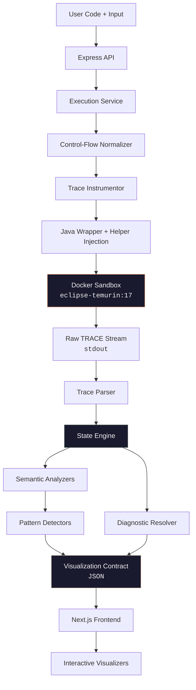

<div align="center">
  <br />
  
  <br />
  <br />

  # CodeScope

  **See your algorithm think.**

  An execution visualizer that compiles, traces, and reconstructs every micro-step of your Java code into an interactive, time-travel debuggable timeline.

  <br />

  
  
  
  
  
  

  <br />

  [Live Demo](https://code-scope-ochre.vercel.app/) · [Documentation](https://code-scope-ochre.vercel.app/docs) · [Report Bug](mailto:vrajrpatel6261@gmail.com)

  <br />
</div>

---

<br />

## 🧭 Why CodeScope Exists

Debugging algorithms with `System.out.println` is guesswork. Standard debuggers show one frame at a time. Neither reveals the full picture — how a recursive tree traversal unfolds, where a sliding window contracts, or at which iteration a pointer overtakes another.

CodeScope eliminates that gap. You write Java, hit execute, and the platform:

1. Compiles and runs your code inside an **isolated Docker sandbox**
2. Captures a **micro-step execution trace** of every variable, branch, mutation, and function call
3. Reconstructs a **deterministic state timeline** from that trace
4. Renders interactive visualizers for Arrays, Trees, Graphs, Linked Lists, and Collections
5. Derives **execution intelligence** — hotspots, cost distribution, recursion profiles, and algorithmic pattern detection

The JVM is the source of truth. If a pointer didn't move in Java, it doesn't move on the screen.

<br />

---

<br />

## 🎥 Demo

| | |
|---|---|
| 🌐 **Live Site** | [code-scope-ochre.vercel.app](https://code-scope-ochre.vercel.app/) |

<br />

---

<br />

## ✦ Feature Overview

<table>
<tr>
<td width="50%">

### 🔬 Time-Travel Debugging
Step forward and backward through every execution state. The active line scrolls into view automatically using bounding-box intersection — not naive centering.

</td>
<td width="50%">

### ⚙️ Sandboxed Execution
Every submission runs in an ephemeral Docker container with `--memory=256m`, `--network=none`, `--pids-limit=64`, a 30s timeout, and a 5MB trace cap.

</td>
</tr>
<tr>
<td>

### 🧠 Execution Intelligence
Empirical analysis of your actual execution — hotspot detection, cost breakdowns (comparisons vs mutations vs assignments), recursion profiling, and memory characterization.

</td>
<td>

### 🕵️ Pattern Recognition
The engine detects algorithmic paradigms directly from execution traces: **BFS**, **DFS**, **Two Pointers**, and **Sliding Window** — each with confidence scoring and evidence chains.

</td>
</tr>
<tr>
<td>

### 🩺 Diagnostic Engine
Replaces raw `NullPointerException` stack traces with contextual explanations: the exact failing line, the variable snapshot at crash time, and actionable suggestions.

</td>
<td>

### 📐 12 Dedicated Visualizers
Arrays, Matrices, Linked Lists, Trees, Graphs, Stacks, Queues, Deques, HashSets, HashMaps, PriorityQueues, and Strings — each with its own rendering logic.

</td>
</tr>
</table>

<br />

---

<br />

## 📦 Supported Data Structures

| Category | Types | Visualization |
|:---|:---|:---|
| **Primitives** | `int`, `long`, `double`, `boolean`, `char`, `String` | Variables Panel |
| **Arrays** | `int[]`, `String[]`, `char[]`, `boolean[]` | Indexed horizontal blocks with pointer tracking |
| **Matrices** | `int[][]`, `char[][]`, `boolean[][]` | 2D grid with `[row][col]` coordinate highlights |
| **Linked Lists** | `ListNode` | Directed node chain with cycle detection |
| **Trees** | `TreeNode` | Binary tree with traversal phase overlays |
| **Graphs** | `List<List<Integer>>`, `int[][]` adjacency | Force-directed layout with BFS/DFS semantic state |
| **Stacks** | `Stack<Integer>`, etc. | LIFO container with push/pop animation |
| **Queues** | `Queue<Integer>`, `Deque`, `PriorityQueue` | FIFO/priority containers |
| **Sets & Maps** | `HashSet<Integer>`, `HashMap<K,V>` | Key-value and unique-set displays |

<br />

---

<br />

## 🏗️ Architecture



<br />

---

<br />

## ⚡ Execution Pipeline

The pipeline transforms raw Java source into a fully interactive visualization in nine stages:

| # | Stage | What Happens |
|:---:|:---|:---|
| **1** | Input Processing | JSON inputs are matched against the Java method signature via `inputRegistry` |
| **2** | Java Wrapping | `ListNode`, `TreeNode`, `__DSAInput`, and `OutputSerializer` classes are injected |
| **3** | Control-Flow Normalization | Braceless `if/for/while` statements are rewritten to block form for safe instrumentation |
| **4** | Condition Normalization | Boolean expressions in branches are wrapped in `__DSA_COND()` interceptors |
| **5** | Trace Injection | `System.out.println("TRACE|...")` statements are inserted at every logical step |
| **6** | Docker Execution | Compiled and executed in a `--network=none`, memory-limited container |
| **7** | State Reconstruction | `StateEngine` applies trace events chronologically with frame-local variable ownership |
| **8** | Semantic & Pattern Analysis | Read-only analyzers derive pointer semantics, traversal phases, and algorithm patterns |
| **9** | Diagnostics | Runtime crashes are intercepted and mapped to the exact failing state with suggestions |

<br />

---

<br />

## 🖥️ Backend Modules

The backend (`Server/src/`) is organized by execution stage:

```text
Server/src/
├── controllers/       → Express route handlers
├── execution/
│   ├── normalizers/   → Control flow, return, loop, condition normalization
│   └── runtime/       → Input registry, type builders, helper code generation
├── state/             → StateEngine — chronological trace-to-state reconstruction
├── structures/        → Per-type state handlers (arrays, trees, graphs, collections, strings)
├── semantic/          → Pointer, loop, call-stack, tree, graph semantic analyzers
├── patterns/          → BFS, DFS, Two Pointer, Sliding Window detectors
├── diagnostics/       → Compilation, runtime, input, platform, unsupported-feature resolvers
├── instrumentation/   → Test suites for normalization correctness
├── routes/            → /execute and /health endpoints
└── utils/             → Logger
```

<br />

---

<br />

## 🎨 Frontend Modules

The frontend (`client/`) uses **Next.js 16 (App Router)**, **React 19**, and **Zustand** for state.

```text
client/app/
├── components/
│   ├── landing/          → Hero, Navbar, FAQ, Data Structures Showcase, CTA
│   ├── visualizer/       → Editor workspace, timeline, variables, intelligence, diagnostics
│   │   ├── complexity/   → Source timeline, loop insight, condition insight, expression panels
│   │   ├── controls/     → Playback controls, step navigation
│   │   ├── intelligence/ → Execution profiler, hotspots, cost distribution, recursion profile
│   │   ├── diagnostics/  → Diagnostic banner, structured error panels
│   │   ├── metrics/      → Execution metrics overlays
│   │   ├── operations/   → Operation tracking
│   │   ├── stack/        → Call stack visualizer
│   │   └── variables/    → Variable inspector panel
│   └── visualizers/      → 12 dedicated renderers (Array, Tree, Graph, Stack, Queue, etc.)
├── docs/                 → Documentation pages with topic routing
├── store/                → Zustand execution store
└── styles/               → Component-scoped stylesheets
```

<br />

---

<br />

## 🔍 Execution Intelligence

The intelligence module runs as a post-processing pass over the reconstructed state timeline. It answers: **"What happened, where did time go, and what characterizes this algorithm?"**

| Metric | Description |
|:---|:---|
| **Time Complexity** | Empirical estimation (`O(1)`, `O(N)`, `O(N²)`, `O(2^N)`, `O(V+E)`) based on loop/recursion patterns |
| **Cost Distribution** | Percentage breakdown: Comparisons · Assignments · Mutations · Overhead |
| **Hotspots** | Top 3 lines by execution frequency (≥5% of total steps) |
| **Recursion Profile** | Max depth, total recursive calls, deepest chain |
| **Memory Characteristic** | `In-Place` · `Heavy Allocation` · `Deep Recursion` |
| **Behavioral Traits** | `Nested Iteration` · `Single Pass` · `Tree Traversal` · `Graph Traversal` · `Collection Heavy` |
| **Execution Timeline** | Phase visualization (Initialization → Processing/Traversal/Expansion → Cleanup) |

<br />

---

<br />

## 🩺 Diagnostics

The diagnostic engine intercepts failures at every stage and returns structured, actionable reports:

| Category | Resolves |
|:---|:---|
| **Compilation** | Missing imports, unknown symbols, type mismatches, missing return statements, syntax errors |
| **Runtime** | `NullPointerException`, `ArrayIndexOutOfBoundsException`, `StackOverflowError`, `ArithmeticException`, `NoSuchElementException`, `EmptyStackException`, `ClassCastException` |
| **Input** | Malformed JSON, parameter count mismatches, unsupported types |
| **Platform** | Docker unavailability, execution timeouts, trace size overflow |

Each runtime diagnostic includes: `failingLine`, `failingStep`, `variableSnapshot`, `probableCause`, and targeted `suggestions`.

<br />

---

<br />

## 🕵️ Pattern Detection

Patterns are detected from the execution trace itself — not from static source analysis:

| Pattern | Detection Strategy |
|:---|:---|
| **BFS** | Queue-driven traversal ownership, `BFS_LEVEL_START` transitions, frontier expansion |
| **DFS** | Recursive call stack expansion aligned with `GRAPH_VISIT` / `TREE_VISIT` events |
| **Two Pointers** | Integer variable pair with strictly opposing monotonic movement (one ascending, one descending) |
| **Sliding Window** | Synchronized expansion/contraction of index boundaries within a single loop |

Each detection returns a `confidence` level (`LOW`, `MEDIUM`, `HIGH`) and an `evidence` array explaining why the pattern was flagged.

<br />

---

<br />

## 🛠️ Tech Stack

| Layer | Stack |
|:---|:---|
| **Frontend** | React 19 · Next.js 16 · Zustand · Framer Motion · Three.js · Monaco Editor · TailwindCSS |
| **Backend** | Node.js · Express 5 · dotenv |
| **Execution** | Java 17 (eclipse-temurin) · Docker |
| **Infrastructure** | PM2 · Health endpoints (`/health`, `/health/docker`) |
| **Testing** | Node test runner · Stress tests · Regression suites |

<br />

---

<br />

## 📂 Project Structure

```text
CodeScope/
├── client/                         # Next.js frontend
│   ├── app/
│   │   ├── components/
│   │   │   ├── landing/            # 12 landing page components
│   │   │   ├── visualizer/         # Workspace: editor, panels, controls
│   │   │   └── visualizers/        # 12 dedicated data structure renderers
│   │   ├── docs/                   # Documentation portal
│   │   ├── store/                  # Zustand state management
│   │   └── styles/                 # Component stylesheets
│   └── public/                     # Logo, static assets
│
└── Server/                         # Node.js backend
    ├── src/
    │   ├── controllers/            # Route handlers
    │   ├── diagnostics/            # 6 diagnostic resolvers
    │   ├── execution/              # Normalizers + input registry
    │   ├── patterns/               # 4 pattern detectors
    │   ├── semantic/               # 6 semantic analyzers
    │   ├── state/                  # StateEngine
    │   └── structures/             # 6 structure families
    └── executions/                 # Ephemeral sandbox volumes
```

<br />

---

<br />

## 🚀 Local Development

### Prerequisites

| Requirement | Version |
|:---|:---|
| Node.js | v18+ |
| Docker Desktop | Latest (must be running) |

### Setup

```bash
# Clone
git clone https://github.com/VrajPatel1635/CodeScope.git
cd CodeScope

# Backend
cd Server
npm install
cp .env.example .env
npm run dev                  # Starts on :5000

# Frontend (new terminal)
cd client
npm install
cp .env.example .env.local
npm run dev                  # Starts on :3000
```

### Environment Variables

**Server** (`.env`):
| Variable | Default | Purpose |
|:---|:---|:---|
| `PORT` | `5000` | Server port |
| `CLIENT_URL` | `http://localhost:3000` | CORS allowed origin |
| `USE_DOCKER` | `true` | Enable Docker sandbox |
| `DOCKER_TIMEOUT_MS` | `30000` | Container execution timeout |
| `MAX_TRACE_SIZE` | `5242880` | Max trace output in bytes (5MB) |

**Client** (`.env.local`):
| Variable | Default | Purpose |
|:---|:---|:---|
| `NEXT_PUBLIC_API_URL` | `http://localhost:5000` | Backend API URL |

<br />

---

<br />

## 🔒 Security

CodeScope executes arbitrary user code. The sandbox assumes every submission is hostile.

| Protection | Implementation |
|:---|:---|
| **Container Isolation** | Each execution gets a unique `sandbox-<uuid>` container |
| **Network Disabled** | `--network=none` prevents outbound requests |
| **Memory Cap** | `--memory=256m` prevents heap floods |
| **CPU Throttle** | `--cpus=0.5` prevents CPU starvation |
| **Process Limit** | `--pids-limit=64` prevents fork bombs |
| **Execution Timeout** | 30s hard kill on the container |
| **Trace Overflow** | 5MB stdout cap kills the container before Node.js OOM |
| **Filesystem Isolation** | Each execution gets a unique `exec_<timestamp>_<hash>` directory, purged after completion |

<br />

---

<br />

## ⚡ Performance

| Strategy | Detail |
|:---|:---|
| **Streaming Trace Capture** | stdout is read incrementally — the 5MB cap triggers mid-stream, not after buffering |
| **State Pruning** | Executions exceeding 1000 states prune early entries to prevent frontend memory bloat |
| **Graceful Shutdown** | PM2-compatible `SIGTERM`/`SIGINT` handlers with a 10s drain window |
| **Cryptographic Container Naming** | `crypto.randomUUID()` eliminates collision risk under concurrent executions |

<br />

---

<br />

## 🗺️ Roadmap

### ✅ Shipped
- [x] Array, Matrix, String, and Collection visualization
- [x] Linked List traversal with cycle detection
- [x] Binary Tree structural tracking with traversal phase overlays
- [x] Graph visualization with BFS/DFS semantic state
- [x] Recursive call stack visualization
- [x] Docker sandboxed execution with multi-layer protections
- [x] Diagnostic engine (compilation + 10 runtime exception types)
- [x] Execution Intelligence (hotspots, cost, recursion, memory)
- [x] Pattern detection (BFS, DFS, Two Pointers, Sliding Window)
- [x] Semantic analyzers (pointers, loops, call stacks, trees, graphs)
- [x] Documentation portal
- [x] Health monitoring endpoints

### 🔜 Planned
- [ ] Multi-language support (Python, C++)
- [ ] Warm container pools to eliminate Docker startup latency
- [ ] True Big-O derivation via multi-input execution curve fitting
- [ ] User authentication and saved code history
- [ ] Collaborative debugging sessions

<br />

---

<br />

## 🤝 Contributing

Contributions are welcome. The instrumentation pipeline, AST normalizers, and trace parser are tightly coupled — if you're adding a new data structure or language, open an issue first so we can discuss the architectural approach before implementation.

<br />

---

<br />

## 📄 License

*License TBD — to be added before public release.*

<br />

---

<div align="center">
  <br />
  <sub>Built by <a href="https://www.vraj-patel.me/">Vraj Patel</a></sub>
  <br />
  <br />
</div>
